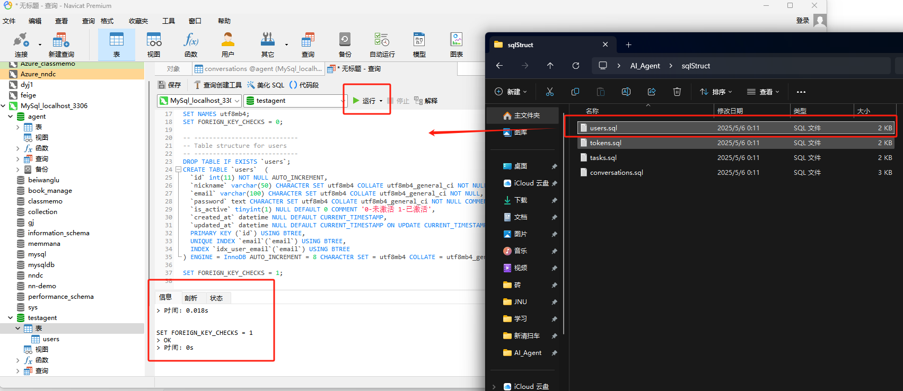
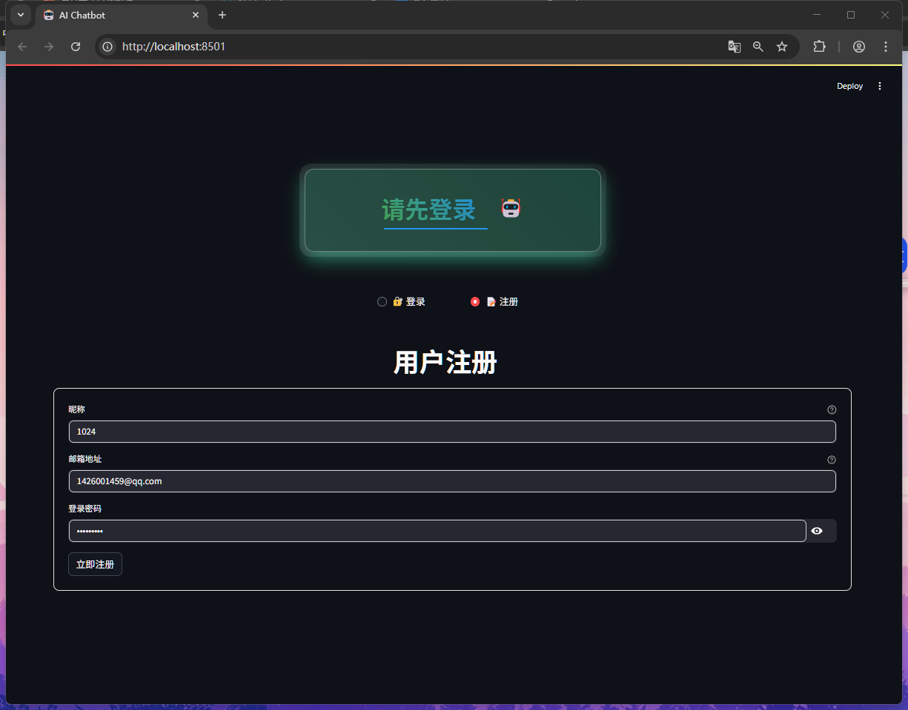
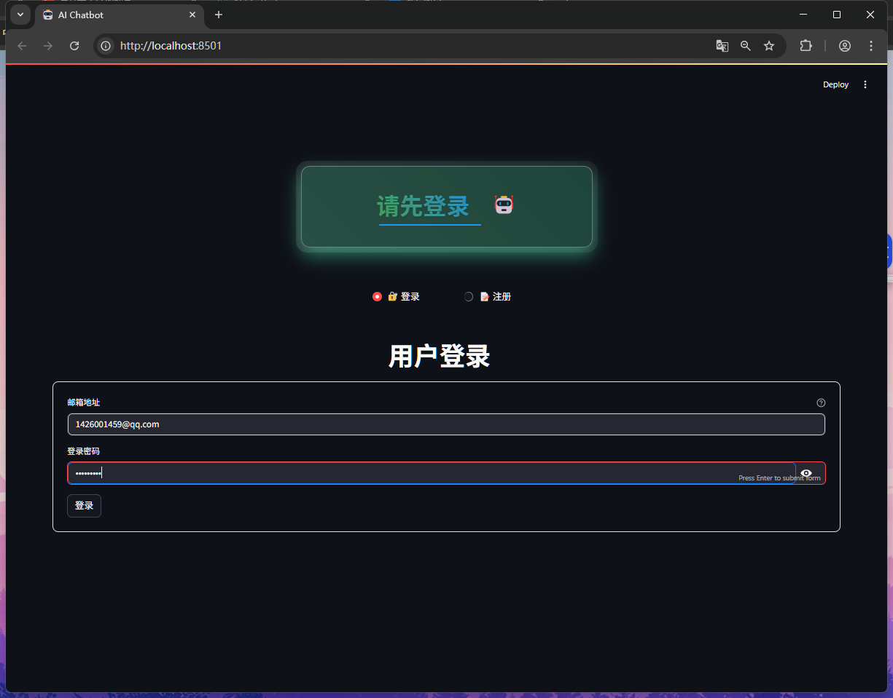
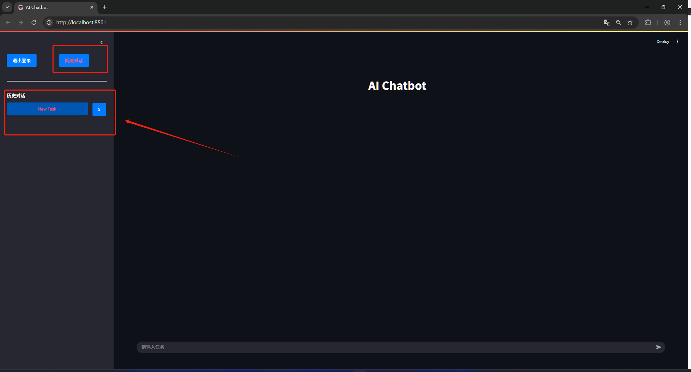
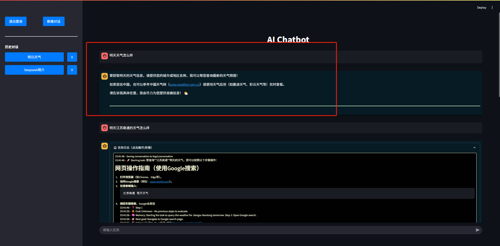
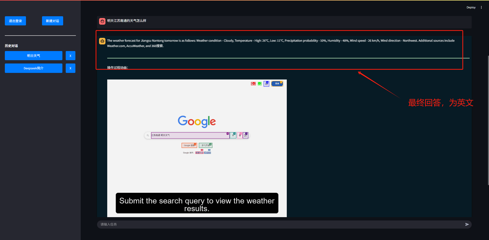
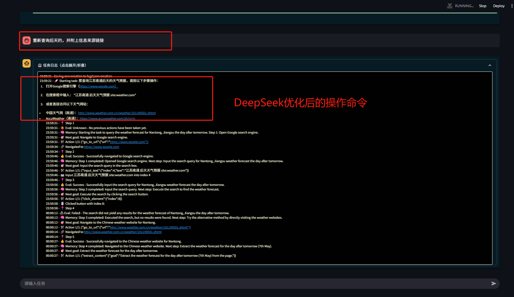
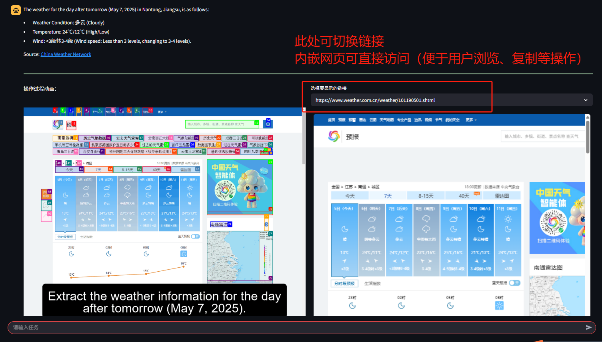

# 基于DeepSeek的通用智能体

## 项目概述

基于DeepSeek的通用智能体是一个具备自动化网页操作能力的智能系统，在基本对话的基础上，通过DeepSeek对用户命令进行决策，可借助浏览器执行多样化的任务。该系统集成了日志管理、对话评估等功能，能依据用户需求精准执行任务，并输出用户预期结果。


## 项目结构

* **`AI_Agent/`** ：项目主目录，包含以下关键文件和子目录：
* **`logs/`** ：日志文件夹，记录不同任务的交互过程和结果，包括与用户的对话、操作步骤、提取的信息等。每个任务的日志以 `conversation_*.txt` 格式存储。
* **`css/`**：Streamlit中使用到的页面样式。
* **`screenshots/`**：browser-use的运行流程gif。
* **`sqlStruct/`**：mysql数据库中的表结构，可以直接通过查询命令添加相关表。
* **main.py**：程序入口。
* **log_handler.py** ：负责日志管理，提供日志管理上下文管理器，可在 Streamlit 应用中临时添加和移除日志处理器。
* **deepseek_api.py** ：用于评估对话是否适合作为 `browser-use` 命令，通过调用 DeepSeek API 进行判断。
* **database.py** ：数据库调用。
* **config_loader.py** ：配置文件（config.json）加载器。
* **auth.py**：用户认证模块。
* **config.json**：配置文件，可配置追加词、内嵌链接网页的大小、api重问次数上限。
* **requirements.txt** ：列出了运行项目所需的 Python 库。


## 功能特性

1. **注册、登录**：用户注册并登录后，系统会存储token，以便下次直接使用而免登录，登录后也可以直接在会话页面退出，此时token失效。
2. **AI 聊天**：登录成功后，用户可以输入任务，系统会根据用户的命令决定是否使用browser-use，若不需要使用到浏览器操作，直接通过api回复即可，否则调用browser-use执行并输出其执行步骤日志，以及流程的gif、相关链接。
3. **聊天管理**：系统会根据用户每个对话的第一次提问，通过询问api的方式，自动生成一个对话名。

## 环境要求

Python 3.9 及以上版本

* 所需 Python 库：
  * `streamlit`
  * `sqlalchemy`
  * `pymysql`
  * `werkzeug `
  * `langchain_openai`
  * `pydantic`
  * `dotenv`

## 运行DEMO

1、**克隆项目**

```bash
cd AI_Agent
```

2、 **安装依赖库 **

```bash
pip install -r requirements.txt
```

3、**MYSQL数据库添加表**

新建一个数据库，打开sqlStruct目录，将其中的sql指令复制到MySQL命令行中，或者在Navicat等集成工具中输入这些sql指令。

以users.sql为例：



4、**资源配置**

创建 .env 文件（可拷贝.env.example文件），并添加以下配置信息，其余项不用管：

```bash
DEEPSEEK_API_KEY=你的API-KEY
DB_HOST=你的主机名
DB_NAME=数据库名
DB_USER=数据库用户名
DB_PASSWORD=数据库密码
```

5、**运行项目**

```bash
python -m streamlit run .\main.py
```

6、**在浏览器中输入网址**

```bash
http://localhost:8501/
```

 

7、**登录、注册**



8、**新建对话**



9、**第一次提问（模糊指令+生成名称）**

可以看出，此时历史对话中的对话名称从“New Task”自动更新为“明日天气”



10、**第二次提问（明确指令）**

此时网页开始调用。




11、**第三次提问（上次答复不尽人意，要求优化输出结果）**

由于DeepSeek存在答复的随机性（不稳定因素），后台需要不断更新评估（config.json中最大上限为3轮）。


12、**Again（要求展示数据来源）**





